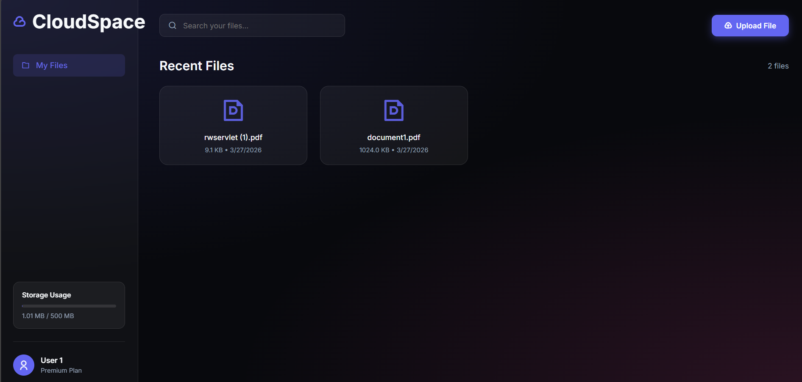

  <h1>☁️ Mini Cloud Storage</h1>
  
A beautiful, fully-functional backend & frontend system for a cloud file storage service. Safely upload, track, and manage your cloud quota.

  <!-- IMPORTANT: Replace the image path below with your actual screenshot! -->
  

 

## ✨ Features
- 🎨 **Premium UI Dashboard:** A fully responsive, glassmorphism dark-mode frontend to manage your files visually!
- 🗄️ **User Quota System:** 500 MB fixed limit per user.
- 🔒 **Strict Concurrency Control:** Enforced via a PostgreSQL `CHECK` constraint to guarantee no storage overages during simultaneous uploads.
- 🧬 **Physical Deduplication:** Maps identical file hashes to a single `PhysicalFile` record while maintaining separate `UserFile` access records for users.
- ⚡ **Prisma ORM:** Clean database modeling and interactions.

## 🛠️ Prerequisites
- **Node.js**: v18+
- **Docker & Docker Compose**: For running PostgreSQL locally.

## Project Setup

1. **Install Dependencies**
   \`\`\`bash
   npm install
   \`\`\`

2. **Database Setup**
   Ensure Docker is running. Start the PostgreSQL instance:
   \`\`\`bash
   npm run db:up
   \`\`\`
   Or explicitly `docker-compose up -d`.

3. **Migrate the Database**
   Push the schema to the database:
   \`\`\`bash
   npm run db:migrate
   \`\`\`
   *(Note: The server startup script will automatically try to execute raw SQL to apply the `500MB` CHECK constraint and unique indexes. If it fails due to the DB not initializing quickly enough, they must be applied manually, but starting the server usually handles it).*

4. **Seed Sample Users**
   Populate the database with User 1, User 2, and User 3:
   \`\`\`bash
   npm run db:seed
   \`\`\`

## Running the Project
\`\`\`bash
npm run dev
\`\`\`
The API will be available at `http://localhost:3000`.

## API Endpoints

A Postman collection (`postman_collection.json`) is included in the root directory.

### 1. Upload File
**POST** `/users/:userId/files`
\`\`\`bash
curl -X POST http://localhost:3000/users/1/files \
-H "Content-Type: application/json" \
-d '{"name": "test.txt", "size": 1048576, "hash": "abc123hash"}'
\`\`\`

### 2. Delete File
**DELETE** `/users/:userId/files/:fileId`
\`\`\`bash
curl -X DELETE http://localhost:3000/users/1/files/1
\`\`\`

### 3. Get Storage Summary
**GET** `/users/:userId/storage-summary`
\`\`\`bash
curl http://localhost:3000/users/1/storage-summary
\`\`\`

### 4. List User Files
**GET** `/users/:userId/files`
\`\`\`bash
curl http://localhost:3000/users/1/files
\`\`\`

## Design Decisions
- **Deduplication:** Instead of a single `Files` table, the schema is split into `PhysicalFile` (tracking unique hashes and sizes) and `UserFile` (tracking user ownership, file names, and active status). This ensures that storing the same file across thousands of users only consumes the storage size once on the disk, saving immense DB and disk space.
- **Concurrency Approach:** Instead of handling pessimistic locking or message queues within Node.js, the most robust way to ensure a storage limit isn't exceeded during concurrent requests is via Database Constraints. The server applies `ALTER TABLE "users" ADD CONSTRAINT "storage_limit_check" CHECK ("totalStorageUsed" <= 524288000)`. When multiple requests hit the DB concurrently attempting to `increment`, Postgres enforces its row-state locks during the flush and guarantees at least one transaction will hit limit and fail with error `23514` if it pushes the user over 500 MB.
- **Soft Deletion:** The system uses `isActive: false` in `UserFile` to mark a file as deleted rather than entirely annihilating the record, providing a safer approach for data-retention logic and history.

## Scalability (100K Users)
- **Database Architecture:** A solid indexing model on `hash` and `userId` handles large user counts perfectly. Over time, horizontal scaling of reads via Replica sets can spread the query load.
- **File Storage Infrastructure:** Actual binary uploads would be decoupled to AWS S3 using pre-signed URLs. The backend only focuses on metadata validation, maintaining extremely low memory/CPU overhead, enabling node effectively handling thousands of concurrent users per instance.
- **Caching:** We can cache the user's `totalStorageUsed` in Redis, updating it asynchronously. However, since the database `CHECK` constraint is our ultimate source of truth for safe concurrency, Redis would act as an *early-rejection* layer preventing unnecessary DB trips for guaranteed-over-quota users, while the database transaction guarantees atomicity.
- **Horizontal Scaling:** As the Express.js endpoints function entirely stateless, we can safely deploy dozens/hundreds of replicas behind an autoscaling load balancer.
